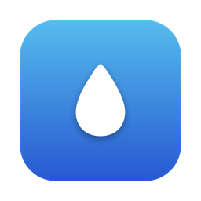

# Backgroundifier

Backgroundifier turns images into desktop wallpapers: the image is centered over an enlarged, blurred (or flat-colored) copy of itself, with a soft shadow. Original by [Alexei Baboulevitch](http://backgroundifier.archagon.net) (2015). 2026 upgrade by Mayk Thewessen.



## What's in the 2026 upgrade

The original public repo was Swift 2.3 and could not build on modern Xcode. It also referenced a storyboard, asset catalog, and embedded zip that were never part of the public release, so the GUI target could not build at all. This version:

- Ports the processing core (`Core/Processor.swift`) to modern Swift. The algorithm is unchanged.
- Replaces the storyboard AppKit UI with a SwiftUI app: drop zone, settings, queue with per-file status, cancel support. Requires macOS 14.
- Replaces the manual GCD work-splitting with a Swift concurrency `TaskGroup` that pulls from the queue dynamically (the old code pre-divided files per core, so one slow file could idle a worker) and stays memory-aware at large target resolutions.
- Replaces the 980-line vendored CommandLine library with a compact argument parser in `CLI/main.swift`. Flags are unchanged.
- Fixes a modern-AppKit rendering bug: an `NSBitmapImageRep` that has been read through `CGImage` (which the vImage blur does) caches that snapshot, and further drawing into it never reaches the encoded output. Rendering is now done in explicit passes with a fresh compositing canvas.
- Keeps the ObjC helpers: `NSImageEffects` (Apple's vImage blur, NSImage port) and `SLColorArt` (Panic's color analysis).
- New app icon, generated in `Assets.xcassets` (the original icon was not in the public repo).

## Build

Xcode 15 or newer, macOS 14 or newer:

```bash
xcodebuild -project Backgroundifier.xcodeproj -target Backgroundifier
xcodebuild -project Backgroundifier.xcodeproj -target bgify
```

## CLI

```bash
bgify -i input.jpg -o output.jpg -w 3456 -h 2234           # blurred background
bgify -i input.jpg -o output.jpg -w 3456 -h 2234 -c auto   # auto-picked flat color
bgify -i input.jpg -o output.jpg -w 3456 -h 2234 -c 1A2B3C # fixed flat color
```

Run `bgify --help` for the advanced tuning flags (blur radius, shadow, edge gap, background scale).

## License

See [LICENSE](LICENSE). `NSImageEffects` is Apple sample code (modified); `SLColorArt` is by Panic Inc. Both carry their own headers.
